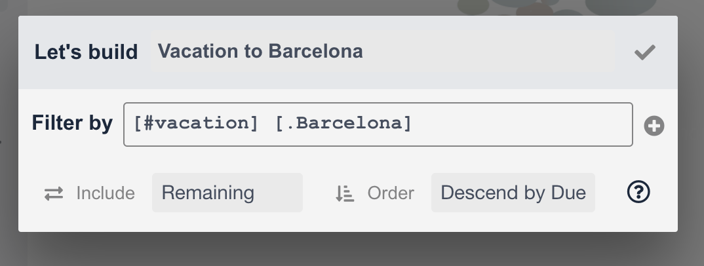
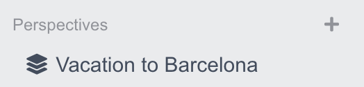
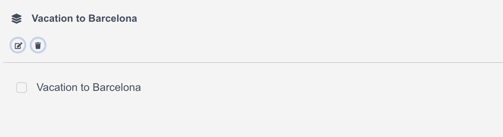
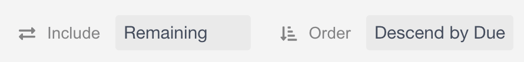

***********************************
Customize Your To-Do: Perspectives
***********************************

Built-in views not enough? Fear not. No one todo list is alike, and they shouldn't be! Condution has a powerful way of building custom "views" of your tasks — completed suited to your needs.

   Here's a perspective menu! Cool, right?

.. note:: Scared yet? Don't be. Read on 😉

Phew! You read on. Good. I know that there's a lot going on in this menu, but you will be up and running with perspectives in just a few minutes.

So what are perspectives?
===========================
Perspectives are filter lists. Think about them as an "advanced search" for tasks that you saved into a view. They are available at all times on the sidebar, under the "Perspectives" section.

Tapping on any populated perspective, you could see a list of tasks that the perspective is filtering for.

Every perspective has a special set of rules (called the "query") that it uses to determine what gets captured by it. Queries are completely customizable by you using a small, declarative syntax.

Defining a Perspective
=======================

Here's that edit menu again. As you could see, there are three different parts to this menu: the big 'ol box in the middle, and two smaller ones on the bottom. 

The big, middle box right next to "Filter by" is what contains your perspective "query" — your message to Condution telling it what to capture inside that perspective; let's spend some time talking about that.

Perspective Queries, in Brief
=============================

In our query syntax, ``[]`` represents a task. The prefix ``#``, a tag, and ``.`` a project. In creating perspectives, the syntax simply matches tasks with the attributes you select.

For those who "learn by example", here are three sample queries and what they filter for.

- ``[#vacation] [.Barcelona]``: tasks with *either* (inclusive) tag "vacation" or is in project "Barcelona"
- ``[#vacation .Barcelona]``: tasks with tag "vacation" *that also* is in project "Barcelona"
- ``[#vacation .Barcelona] [#aftercare]``: tasks that has tag "vacation" *that also* is in project "Barcelona" or simply has tag "aftercare"
- ``[#vacation .Barcelona !#aftercare]``: tasks that has tag "vacation" *that also* is in project "Barcelona" but *does not* have tag "aftercare"

For more detailed information regarding perspective syntax, head over to LINK LINK LINK LINK our Manual entry on the perspective syntax.

.. note:: Quick Tip: some users have asked to create perspective filtering for every task. A syntax like ``[!#_]`` should do because it's filtering for all tasks that does not have tag ``_``

Customizing your perspectives
==============================
Now that we are done with the big button, here's some talk on the smaller two buttons.

    Namely, these buttons.

These values help you place one more layer of filtering above your syntax, and helps Condution figure out what order to place the tasks in the perspective.
