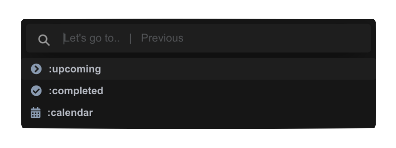
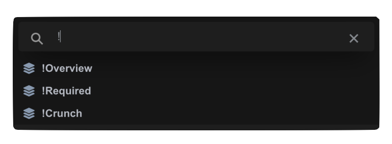
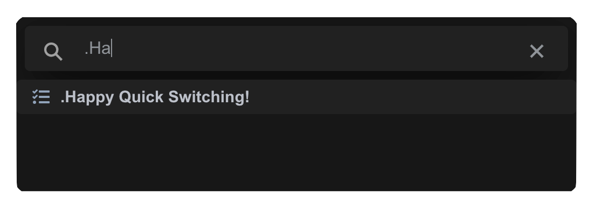

*********************************
Navigating with the Quickswitcher
*********************************
When using Condution, the quickswitcher is the fastest way to move around. Activate it by pressing Command/Control - k.

Using it, you can search through and navigate with a list of all default pages, perspectives, and projects, including sub-projects! You can narrow down the options by typing in the search field, then select the option you want to navigate to with Control - n/p keybinds, arrow-keys, or by clicking.

All option types are prefixed with a character. You can type these characters into the search field to instantly narrow down the search options.

The prefixes are:

Default pages => :
Perspectives => !
Projects => .

Pressing esc or clicking outside will dismiss the quickswitcher.

Activating the quickswitcher then instantly pressing enter will switch back to the previous page.

.. TODO get these images in light mode please
