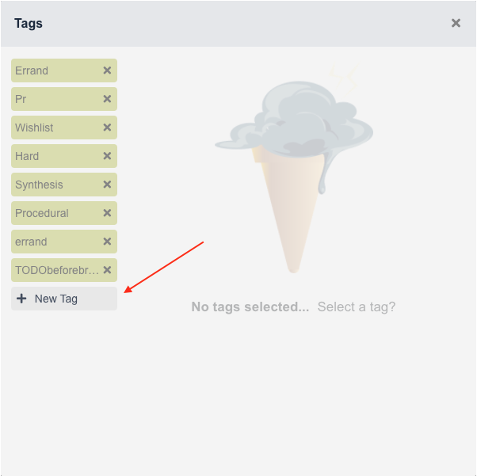

**************
Utilizing Tags
**************

Tags are central to Condution since they're largely what inform perspectives and dictate task weight. In this guide, we'll guide you through the different ways to create and interact with tags as well as delete them.

Creating a Tag
++++++++++++++

There are two main ways to create a tag. The first and recommended way is to simply move to the tags box within a task, type the tags name, and hit enter. If this name doesn't match the name of any other existing tag, it'll simply create a new one and assign it to that task.

The second way is to navigate to the tags pane inside the task and hit "New Tag" as shown below.

.. TODO maybe make smaller

Doing so will create a new tag with the name "New Tag". To rename it, simply click on that tag and set the name box as shown below to the desired name.

Deleting Tags
+++++++++++++

Deleting tags is a very useful feature that was missing in Condution for far too long. Many Condution veterans will recite bloodcurdling tales of mistyping a tag name only to end up with a typo tag of similar name. One that was impossible to be rid of and would almost always pop up in the dropdown instead of the desired one.

Thankfully, those dark ages have since passed and to delete a tag, all you have to do is navigate to the tags pane within any task and click the x button next to it. As mentioned before, you always have the option of renaming them too if you so wish.

Tag Weights
-----------

Besides their use in filtering, tag weight is one of the most useful aspects of tags in general.

So what are they? Tag weights are settable values that dictate the weight of the task they're assigned to. Tag weights are multiplicative meaning if I create a tag with weight 2named "hard", and assign it to a task with one other tag with weight 0.5 named "easy", the task will still have weight 1. Task weights are used to describe how time and energy intensive a given task is which is why it makes sense to be able to assign different tags describing the task and have those determine the overall weight.

Setting a tag weight is easy. All you need to do is navigate to the tags pane within any task and click on the tag you want to set. Then as shown below, type the desired weight and hit enter.

.. add image

