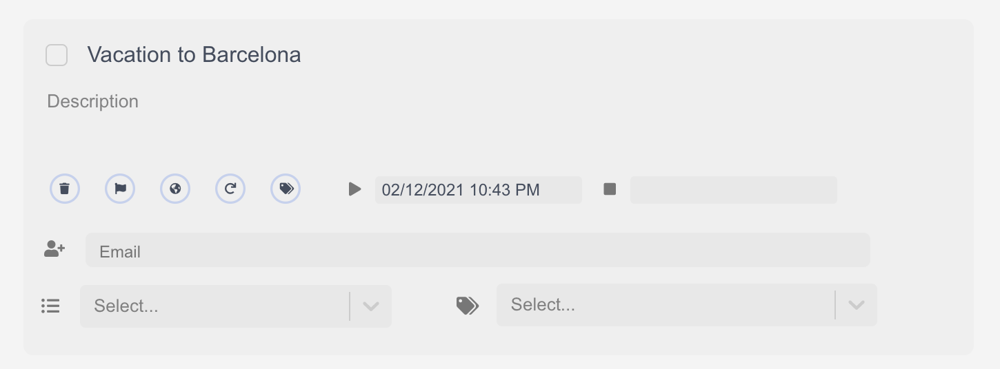

*****************
Anatomy of a Task
*****************

Tasks are the center of every productivity app which is why they're so crucial to understand. In this guide, we'll walk you through the different ways to add and interact with tasks.

Adding a task
-------------

There are two ways to make a task. If you're inside a project, you can simply press the add a task button. However, if in the moment simply want to add a task to your inbox for later sorting, you can use our FAB (Floating Action Button) as seen below.
.. add image
To make your life even easier, our FAB include natural language support. This means you can simply say things like "Wash the car from 8 to 9 on sunday" and it'll add a task with the deffer date of Sunday at 8 and due date of sunday at 9.
.. add image

Inside a task
-------------

Inside of the task there are quite a few elements as can be seen in the below diagram.

The Delete Button
+++++++++++++++++

The Delete button deletes a task... yeah that's about it.

The Flag Button
+++++++++++++++

When pressed, the flag button flags a task.

Flagged tasks can be filtered using perspective filters. A brief tutorial on how to use perspective filters is `available here`_.

.. _available here: /guides/perspectives.html

The Globe Button
++++++++++++++++

The globe button toggles between floating and fixed timezones.

Let's say for example you needed to call your mother at 8pm every Friday and one day you happen to travel to Japan. If you had fixed timezones enabled (the default), when you arrive, calling your mother would appear due 8pm plus the time difference between wherever you live and Japan.

However, say for example you want to do Yoga between 5-6pm as well, but you wanted to do it at 5-6pm whereever you are, you can used Floating Timezones.

The Repeat Button
+++++++++++++++++

Using the repeat button on a task allows you to set a task to repeat.

Clicking it will reveal a model as shown below:

.. add image
