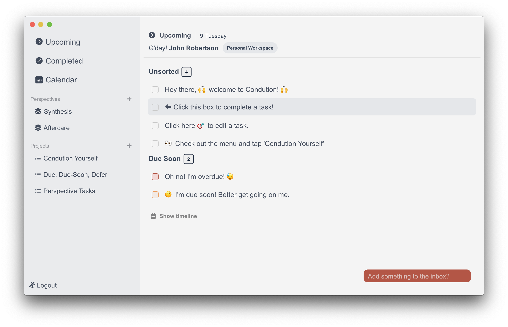

.. Condution documentation master file, created by
   sphinx-quickstart on Mon Feb  8 12:13:29 2021.
   You can adapt this file completely to your liking, but it should at least
   contain the root `toctree` directive.

.. toctree::
    :hidden:
    :maxdepth: 4

    guides/guides
    manual/manual
    developer/developer

    test

*********************
The Condution Project
*********************

👋 **Howdy!** How are you doing?

Welcome to the documentation for The Condution Project. You know, `that task manager`_?

.. _that task manager: https://www.condution.com/

Where are you headed?
====================
.. HTMLify this to be pretty
- **Need tutorials, workflows, and tips?** Head over to :ref:`guides/guides:Condution Guides`
- **Need a precise manual documenting all of our features?** Go to :ref:`manual/manual:Condution Manual`
- **Need** :code:`@condution/engine` **help?** Go to :ref:`developer/developer:Condution Developer`

.. include:: test.md

